# Siprifi Prediction Market MVP – Architecture Review & Roadmap

**Document Version:** 1.0
**Date:** 2026-01-15
**Status:** MVP Technical Architecture (Pre-Lending Phase)


### Architectural Intent

This MVP implements the **risk tokenization layer** of Siprifi Finance.

* Each prediction market is isolated
* Risk is expressed as ERC20 YES / NO tokens
* ETH is escrowed per market
* No AMM, oracle, or lending logic is included

> This is a **foundational primitive**, not the full Siprifi protocol.

---

## 2. Core Contracts Overview

| Contract                 | Responsibility                               | Status      |
| ------------------------ | -------------------------------------------- | ----------- |
| `PredictionMarketV2.sol` | Market lifecycle, escrow, resolution, payout | Implemented |
| `MarketToken.sol`        | ERC20 YES / NO outcome tokens                | Implemented |

---

## 3. PredictionMarketV2 – Contract Architecture

```mermaid
graph TB
    CREATE[createMarket]
    BUY[buyYesShares]
    RESOLVE[resolveMarket]
    CLAIM[claimReward]

    CREATE --> TOKENS[Deploy YES/NO Tokens]
    BUY --> MINT_YES[Mint YES → Buyer]
    BUY --> MINT_NO[Mint NO → Market Owner]
    BUY --> ESCROW[ETH Escrowed in Contract]

    RESOLVE --> OUTCOME[Outcome Stored]

    CLAIM --> BURN[Burn Winning Tokens]
    CLAIM --> PAYOUT[ETH Payout]

    style ESCROW fill:#FF9800
    style PAYOUT fill:#4CAF50
```



---

## 4. Market Lifecycle (MVP)


---

## 5. Economic Model (Current MVP)

### 5.1 Share Minting Logic

| Action             | Result                       |
| ------------------ | ---------------------------- |
| Buy YES with X ETH | YES: X minted to buyer       |
|                    | NO: X minted to market owner |
|                    | ETH locked in escrow         |

**Assumptions:**

* Fixed 1:1 pricing
* No dynamic probability
* No liquidity curve

---

### 5.2 Payout Formula

```text
payout = (marketEscrowETH × userWinningBalance) / totalWinningSupply
```

Properties:

* Zero-sum per market
* Proportional distribution
* Deterministic

---

## 6. Trust & Security Model (Explicit MVP Assumptions)

### 6.1 Trust Assumptions

| Component         | Trust Model         |
| ----------------- | ------------------- |
| Market Resolution | Fully trusted owner |
| Pricing           | Fixed mint ratio    |
| Oracle            | None                |
| Governance        | None                |

> These assumptions are **intentional for MVP speed**.

---

### 6.2 Known Security Gaps

| Risk                   | Description                     |
| ---------------------- | ------------------------------- |
| Centralized resolution | Owner can resolve dishonestly   |
| No reentrancy guard    | `claimReward` vulnerable        |
| Shared ETH balance     | Needs per-market escrow mapping |
| No pause mechanism     | Cannot halt in emergencies      |
| No dispute window      | Resolution is final             |

---

## 7. Code Status Summary

### Implemented ✅

* Market creation
* ERC20 YES / NO tokens
* ETH escrow
* Outcome resolution
* Proportional payout

### Not Implemented ❌ (By Design)

* AMM pricing
* Oracle resolution
* Secondary trading
* Lending / collateral logic
* Liquidation

---

## 8. Planned Short-Term Improvements (V1)

| Priority  | Feature               | Description                  |
| --------- | --------------------- | ---------------------------- |
| 🔴 High   | Per-market escrow     | Prevent cross-market leakage |
| 🔴 High   | ReentrancyGuard       | Secure reward claims         |
| 🟡 Medium | Permissioned resolver | Multisig / DAO               |
| 🟡 Medium | Dispute window        | Challenge resolution         |
| 🟢 Low    | Market fees           | Protocol revenue             |

---

## 9. Siprifi Finance Integration Roadmap

### Phase 0 – Current (This Repo)

* Risk tokenization
* Binary outcome tokens
* ETH-settled markets

### Phase 1 – Collateral Acceptance

* YES / NO tokens whitelisted
* Oracle-based pricing
* LTV parameters
* Deposit-only lending

### Phase 2 – Risk Engine

* Concentration limits
* Correlated market groups
* Borrowing power offsets

### Phase 3 – Full Protocol

* Permissionless markets
* DAO governance
* Safety module
* Cross-market liquidity

---

## 10. How This MVP Fits the Whitepaper

| Whitepaper Concept | MVP Status    |
| ------------------ | ------------- |
| Outcome shares     | ✅ Implemented |
| ERC20 collateral   | ✅ Implemented |
| Capital efficiency | ❌ Not yet     |
| Lending            | ❌ Future      |
| Risk engine        | ❌ Future      |

> This MVP validates **the atomic unit of Siprifi risk**.

---

## 11. Deployment Notes

* Target: Testnet only
* Solidity: ^0.8.24
* No audits
* No upgradeability

---

## 12. Disclaimer

This code is experimental and unaudited.

* No financial guarantees
* No oracle protections
* Use for research and prototyping only

---

**© 2026 Siprifi Finance – Internal MVP Architecture Document**
